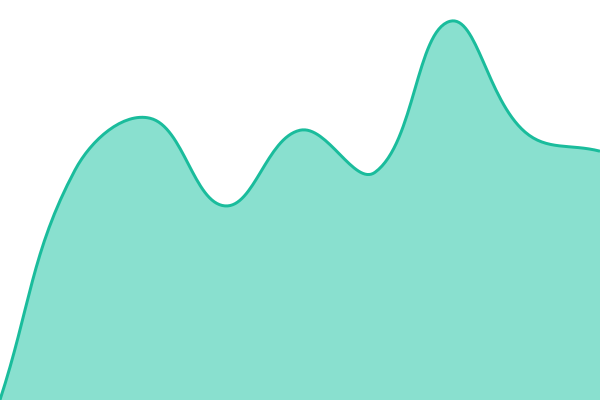

# [📈 Live Status](https://demo.upptime.js.org): <!--live status--> **🟩 All systems operational**

This repository contains the open-source uptime monitor and status page for [Gianpiero Caretti](https://www.gpsoftware.it), powered by [Upptime](https://github.com/upptime/upptime).

With [Upptime](https://upptime.js.org), you can get your own unlimited and free uptime monitor and status page, powered entirely by a GitHub repository. We use [Issues](https://github.com/gpcaretti/upptime/issues) as incident reports, [Actions](https://github.com/gpcaretti/upptime/actions) as uptime monitors, and [Pages](https://demo.upptime.js.org) for the status page.

<!--start: status pages-->
<!-- This summary is generated by Upptime (https://github.com/upptime/upptime) -->
<!-- Do not edit this manually, your changes will be overwritten -->
<!-- prettier-ignore -->
| URL | Status | History | Response Time | Uptime |
| --- | ------ | ------- | ------------- | ------ |
|  [PiP](https://www.portamiinpista.it) | 🟩 Up | [pi-p.yml](https://github.com/gpcaretti/upptime/commits/HEAD/history/pi-p.yml) | 

 1669ms
     
 | 

<a href="https://gpcaretti.github.io/upptime/history/pi-p">99.53%</a>
    

|  [Juris](https://www.jurisweb.it) | 🟩 Up | [juris.yml](https://github.com/gpcaretti/upptime/commits/HEAD/history/juris.yml) | 

 1024ms
     
 | 

<a href="https://gpcaretti.github.io/upptime/history/juris">100.00%</a>
    

|  [GP software web site](https://gpsoftware.it) | 🟩 Up | [gp-software-web-site.yml](https://github.com/gpcaretti/upptime/commits/HEAD/history/gp-software-web-site.yml) | 

 1712ms
     
 | 

<a href="https://gpcaretti.github.io/upptime/history/gp-software-web-site">100.00%</a>
    

|  [TAIS Naples](https://taisnaples.it/administration/) | 🟩 Up | [tais-naples.yml](https://github.com/gpcaretti/upptime/commits/HEAD/history/tais-naples.yml) | 

 937ms
     
 | 

<a href="https://gpcaretti.github.io/upptime/history/tais-naples">100.00%</a>
    

<!--end: status pages-->

[**Visit our status website →**](https://demo.upptime.js.org)

## 📄 License

- Powered by: [Upptime](https://github.com/upptime/upptime)
- Code: [MIT](./LICENSE) © [Anand Chowdhary](https://anandchowdhary.com), supported by [Pabio](https://pabio.com)
- Data in the `./history` directory: [Open Database License](https://opendatacommons.org/licenses/odbl/1-0/)
